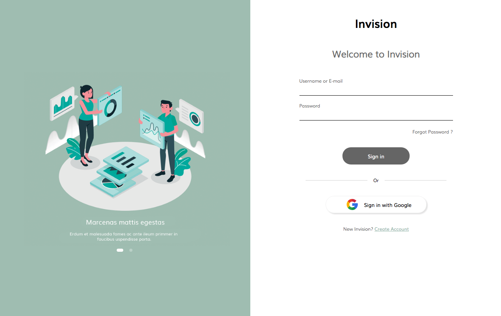

## Wesley Oliveira
> Front-end developer test by Wesley Oliveira..




## Installation

OS X Windows & Linux:

```sh
npm install
```

## Execute

OS X Windows & Linux:

```sh
npm start
```


## Main Technology

This project are developed using ReactJS at version 16.13.1

## Libraries

* Node SASS - 4.14.1
    * Library for using preprocessors
* Font Awesome - 4.7.0
    * Library responsible for application icons
* Unform - 2.1.3
    * Uncontrolled Forms library to components performance.
* React Responsive Carrousel - 3.2.9
    * Library responsible for displaying images on carousel
* React Router Dom - 5.2.0
    * Library responsible for managing application routes
* React Toastify - 6.0.8
    * Alert library
* YUP - 0.29.2
    * Form validate library

## Author

Wesley Morais de Oliveira – [GitHub](https://github.com/oliveirawesley) - [linkedin](https://www.linkedin.com/in/wesleymoraisdeoliveira/)


